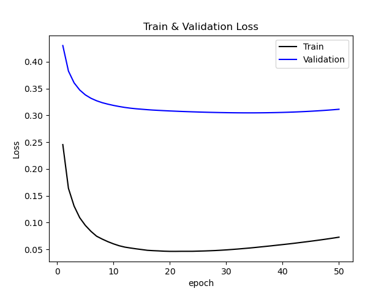
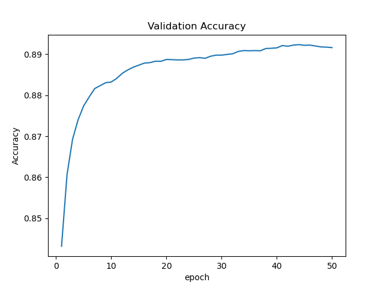
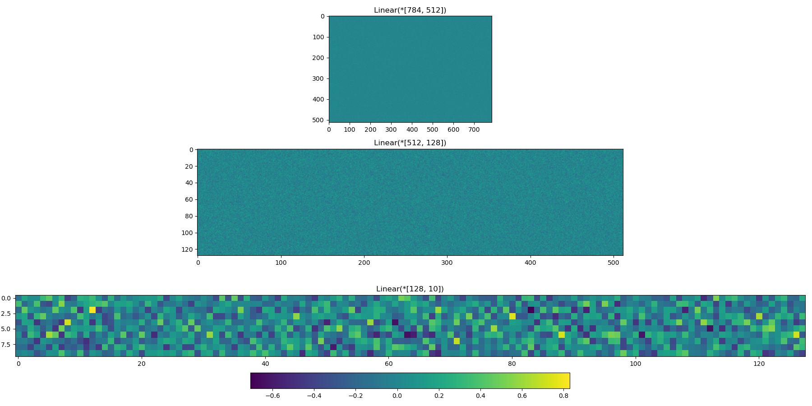

# CV project 1

李斌 19300180089

- 项目地址[github]：https://github.com/RakeDolint/CV-myNN
- 最佳模型[百度云]：
    - 链接：https://pan.baidu.com/s/1Y8aDCdToV_pQpGC_lr8Zdg?pwd=1234 
        提取码：1234

# 1. 数据集

## 1.1 介绍：

**Fashion MNIST**是Zalando Research创建的用于图像分类的基准图像数据集，旨在替代传统的手写数字MNIST数据集。数据集共包含60,000个训练样本和10,000个测试样本，总计70,000个图像。这些样本涵盖了10个不同的时尚物品类别，包括T恤/上衣、裤子、套头衫、裙子、外套、凉鞋、衬衫、运动鞋、包和踝靴。每个类别有6,000张训练图像和1,000张测试图像。每张图像的尺寸为28x28像素，与MNIST数据集相同。这些图像都是灰度图像，像素值在0到255之间。尽管Fashion MNIST的大小、格式和训练集/测试集划分与原始的MNIST完全一致，但是在Fashion MNIST上的分类任务更具挑战性，因为时尚物品的形状、纹理和颜色等特征比手写数字更为复杂。

## 1.2 数据预处理：
本次实验中我也对Fashion MNIST数据集中的数据进行了预处理操作，通过Fashion MNIST的工具函数 `utils`/`mnist_reader`直接将字节类型的图像读取成二维张量，然后我将像素值归一化处理，以加快模型的收敛速度并减少梯度消失或爆炸的可能性。此外，由于标签值`y`为对应类别的序号标量，为适配多分类模型，我对`y`也进行了独热编码（One-Hot Encoding）。

# 2. 模型介绍

本次实验中实现的模型具有自由度高、可拓展性强的特点：可以在生成网络架构的地方自由增删或更换模型中对应类型的组件；只要按照各组件的基础类实现自定义的组件类，就可以即时拓展使用。

## 2.1 基本组件：

### 2.1.1 Parameter

我将权重`W`和偏置`b`都包装到自定义的`Parameter`类中，同步保存对应梯度到类变量里，方便管理更新与查找参数的梯度值

### 2.1.2 Layer

层次架构设计一定程度上参考了`pytorch`中`torch.nn.Sequential()`的设计，除了包装线性全连接层，还将激活函数视为一个特殊的layer，其backward方法即对应激活函数的导数实现。

### 2.1.3 Net

本次实验中网络的架构仅设置了串联结构的网络模型，类似于`torch.nn.Sequential()`，类似地，可以在搭建神经网络模型时自定义隐藏层的个数与形状，以及各隐藏层之间的激活函数类型

## 2.2 训练模式：

### 2.2.1 学习率下降

包装在`LrScheduler`类中，学习率下降暂时实现了两种衰减策略：

- 指数衰减：$\text{lr} = \text{lr}_0 \cdot e^{-k \cdot t}$ 
- 阶梯衰减：$\text{lr} = \text{lr}_0 \cdot k ^ t$

阶梯衰减较为简单直接，学习率等比例下降，但是实际使用过程中也取得了不错的效果。

### 2.2.2 SGD优化器

包装在`SGD`类中，对应地配置了一个`LrScheduler`，根据其更新的学习率和`Parameter`中存储的参数值与梯度值来应用SGD算法更新参数值

### 2.2.3 L2正则化

L2正则化等价于权值衰减，故利用L2正则化参数值计算出权值衰减率，并在SGD优化过程中应用权值衰减。

### 2.2.4 交叉熵损失函数

由于本次实验是多分类任务，故loss函数选择了交叉熵损失函数，包装在`CrossEntropyloss`类中，对应输出层的激活函数也固定为`softmax`，二者结合可便捷地得到loss对softmax求导的结果为：$y_{predict}-y_{truth}$

## 2.3 反向传播过程

利用链式求导法则的特性，我们可以递推式地求出各层参数值的梯度：loss对输出层的激活函数softmax值的梯度已在上文给出，只需递归式地用loss对上一层参数的梯度乘以本层的导数值，即可得到本层参数的梯度值。

直接在各layer的实现中对应地定义该层的导数即可实现代码复用，层层递进地更新各层参数梯度值。

# 3. 训练与测试

代码中定义的workflow函数可以帮助我们轻松地提交一次训练或测试的任务，只需设定好参数与加载/保存模型的路径，即可轻松实现一次工作流任务。

具体参数含义与设置在代码的函数文档和使用示例中已有提供，此处不再赘述。

# 4. 结果与分析

## 4.1 训练过程可视化：

以下数据均源自于某次训练得到的典型特例，其神经网络层次为：`[Linear(*[784, 512]), Relu(), Linear(*[512, 128]), Relu(), Linear(*[128, 10])]`，在`batch_size = 64`的设定下（其他超参数为默认值），训练50个epoch后得到的结果：

可以看出，随着训练批次数增加，训练集的loss先急剧下降，后缓慢回升，而验证集的loss先急剧下降后回升，验证集的acc急剧提升后缓慢提升，最后有略微的抖动下降趋势。可以判断出模型在训练20个epoch左右时效果已达到局部最优，而到50个epoch时已经出现了过拟合的现象了。

## 4.2 权重参数可视化

模型三层权重值的热力图如上，可以看出，对于全连接层，其参数值大多都比较平均与随机，不存在明显的模式。